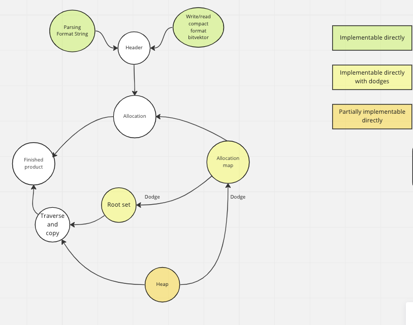
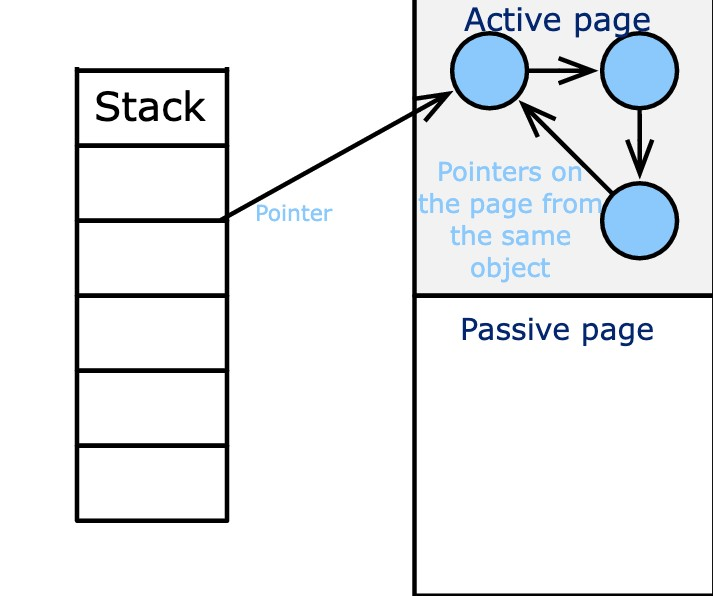
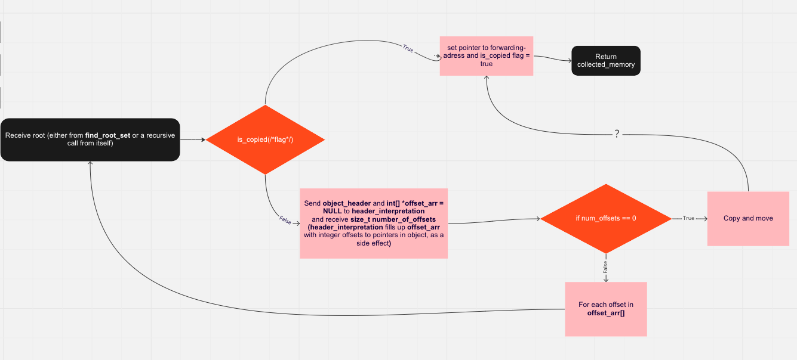

# Design
The garbage collector’s main functions are all in the file “gc.c”, which is why the garbage collector's interface “gc.h” must be included in all files where data is to be allocated. The project has been split into nine different modules where most of them have their own files. As seen in the picture below most of these functions are dependent on at least one or two other modules.  

In the finished project all of these modules work together in order for gc.c to work. The starting point of the program is the function h_init() which is called with the total number of bytes the user needs and a threshold for how full the storage can become before the garbage collecting algorithm starts. The function then returns a pointer to a block of memory allocated on the computer which we below is referenced to as our heap. It is important to notice that only about half of the total bytes will be used to store data on. This is because of our garbage collection algorithm which partly follows the conservative compacting after Bartlett method. This method splits the total amount of bytes into pages where half of the pages are active and the other half are passive. Only the active pages will be used to store data on while the passive pages are used for the garbage collecting algorithm to work.

To use the garbage collector the user first calls the function h_alloc_struct or h_alloc_data which is how the program allocates space on the heap. 
1. First the function finds an active page which has enough space to allocate what is needed. The function sends back an address to the free space.  
    
2. Step 1 will be done until the program reaches its fixed threshold (which the user decided in h_init()). The pressure check for this threshold is done every time a new page is set to active. When the heap has become as full as the set threshold, the garbage collecting begins. 

3. The garbage collecting algorithm starts in the module “find root set”. Find root set checks the stack for an object that we interpret as a pointer. The find root set module together with the allocation map will interpret the object and make sure that it is in fact a pointer. If we find something on the stack that according to these modules is not a pointer we do nothing. If we on the other hand find a pointer the traverse and copy module is called with said pointer.

4. The traverse and copy module interprets the pointers header and copies it over to a passive page in the heap. (A passive page is only used in the garbage collecting part of the program). If traverse and copy finds that this object has multiple pointers. It will recursively call itself to copy all these pointers to the passive page as well (if possible). As the picture tries to demonstate below.

5. Step 4 to 5 is then done over and over again until the program has iterated over the entire stack. At this point the program has copied all active pointers to a passive page and this is when the garbage collecting module actually collects garbage.

6. The garbage collector module will iterate over all pages in the heap and will behave differently depending on the different flags each page has.
    1. If the page is active without unsafe pointer: Reset bump-pointer, make page passive and reset allocation map.
    2. If page is active with unsafe pointer: Do nothing
    3. If page is passive and bump-pointer at the start of page: Do nothing
    4. If page is passive and bump-pointer is not at start (= page contains copied objects): Change the page to active

The pages that have the characteristics of 1. Will be the pages that will be cleared. All items on these pages will be removed, this is the garbage collecting. The pages that have the characteristics of 2. Will be our new active pages, meaning the pages that store data on our heap. 

  

The picture below is a representation of how the traverse and copy algorithm works.

 