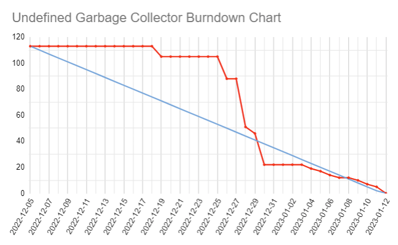
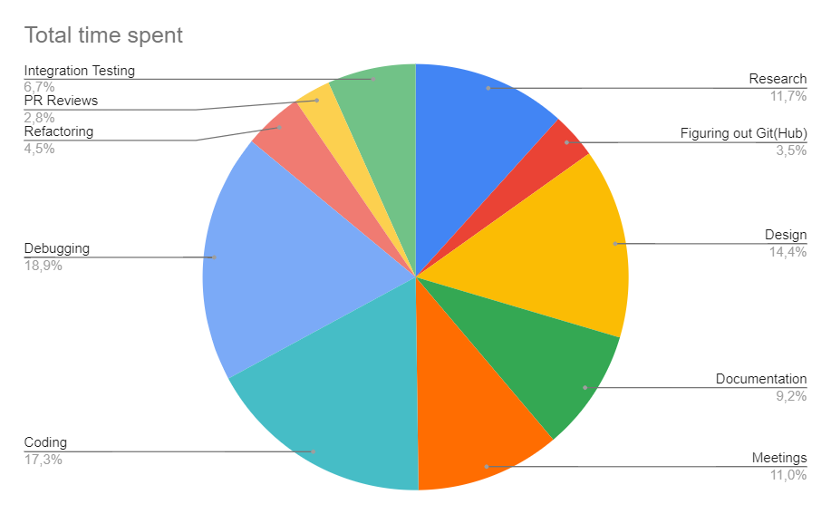

# Group Name
We named our project group 'Undefined' by majority vote (we had to come up with\
some name starting with the letter U).

## Team Members
- Simon Eriksson, GitHub: [@sier8161](https://www.github.com/sier8161) Email: simon.eriksson.8161@student.uu.se
- Daniel Brown, GitHub: [@danielrbrown](https://www.github.com/danielrbrown) Email: daniel.brown.4990@student.uu.se
- Oliver Hansson, GitHub: [@OliverHansson](https://www.github.com/OliverHansson) Email: Oliver.hansson.0007@student.uu.se
- Erik Braathen, GitHub: [@Erikbraa](https://www.github.com/Erikbraa) Email: erik.braathen.9122@student.uu.se
- Ville Friberg Elings, GitHub: [@vfe01](https://www.github.com/vfe01) Email: ville.fribergelings.2166@student.uu.se
- Fredrik Jäderblom, GitHub: [@jaderflow](https://www.github.com/jaderflow) Email: fredrik.jaderblom.0183@student.uu.se

# Quantification
The project officially started at 2022-12-05 however our group had a couple of 
members who were still working on other assignments and courses.\
We planned on 
beginning 2022-12-12, but we also had trouble getting in contact with the coach 
at the start, so we got delayed another week and ended up starting on 2022-12-19.

We had 3 sprints, each a week long with the first one starting 2022-12-19.\
Sprint 1: Writing the individual modules for the project, 2022-12-19 - 2022-12-26\
Sprint 2: Integrating and finalising all individual modules, 2022-12-26 - 2023-01-01\
Sprint 3: Performance testing, integrating with existing program and writing reports, 2023-01-02 - 2023-01-08\
Project handin hard deadline: 2023-01-12 at 13:15

Burndown chart:\

Total number of new lines of C code written excluding tests and preexisting code: 1254\
Total number of lines of test code: 1544\
Total number of lines of “script code” (e.g. Makefile): 86

## Hours worked

|  Hours worked  |  Category    |
|-----|------------------------:|
| 81  |  Research               |
| 24  |  Figuring out git(hub)  |
| 100 |  Design                 |
| 64  |  Documentation          |
| 76  |  Meetings               |
| 120 |  Coding                 |
| 131 |  Debugging              |
| 31  |  Refactoring            |
| 19.5|  PR Reviews             |
| 46.5|  Integration Testing    |
| 693 | TOTAL                   |

Total number of git commits: 285\
Total number of pull requests: 27\
Total number of GitHub issues: 8

# Process

## Inception
The process we chose was Scrum, both because we thought it would be flexible and modern, but also because the instructions more or less stated it to be the process to pick.
We had a meeting discussing the matter and one member had a good understanding of the process and taught the others about it. We implemented the process by having daily meetings at 12.15, and using a shared Google Drive document containing a 'High/medium level modular design' where we could update in real time what parts were done and not during the development of the code.
We also had a Trello board containing basically the same content as the document, which led to some abandonment of the Trello board and we used just the document with tasks more than Trello. Towards the end of the project some effort was put in to try and make more use of the Trello board again, which succeeded.

In the planning phase of the project the vision we had was to have 4 sprints. The first sprint was unfortunately lost mainly due to some misunderstandings regarding the first coach meeting. Therefore the first sprint got mixed into the other three. The planning in general worked really well but because of 'the lost week' the feeling during the project was that it was quite stressful and time sensitive. The sprints themselves however worked almost perfectly. Each sprint contained some modules that the group visioned would be necessary for the project. And because of the good research and planning of these modules in the beginning of the project we planned in which order these modules should be implemented. And that's how the modules got divided into their respective sprint. Logically the heap module was one of the first to be implemented since the entire project builds on that specific module.

In a project of this size it is logical to think that a few tasks were over/under -estimated in the planning phase. So was also the case for us. We never realised that so much time would be spent solving problems when modules were integrated. Especially at the end of the project where all the garbage collectors modules were integrated into one program. When one bug was solved another one appeared somewhere else. 

Another thing the group underestimated was the time it took to understand how the project was to be implemented. Most team members felt like the project started without any clarification on how to go about things. Questions like “Are we supposed to do …?” or “Are we allowed to change this?” and “How should the garbage collector work?” are just a few examples of the large list of questions. The first 1-2 weeks of the project not much coding was done and a big part of that was the unclear project description.

The first and second week of the project were mostly used for planning, researching and discussing amongst the group how the project should be implemented. The third and fourth week is where most of the coding happened. This is where most modules, tests, makefile, integrationTesting etc got done. Lastly the fifth and sixth weeks are where the integration of modules, the implementation into ‘Inlupp2’ and where the documentation has been done as well as the preparations for the seminar.

## Implementation
The best thing we implemented from the scrum process is the daily meetings as stated previously. Furthermore we also planned sprints and developed sprints as explained in the scrum process. 

The biggest strength we found of scrum is that we always stayed connected with each other and up to date in what all team members were working on. The biggest weakness of scrum, especially at our level, is that it takes a lot of time to get it to work properly. Sometimes it took more time learning scrum than the time saved by it. When scrum is applied in real workplaces there is a scrum master and more important roles. People also get educated in the process, which we never did. So our solution was a simplification of the actual process, but overall it was a good choice of process.

Most of the modules were implemented in detail from the beginning, this led to some problems because of the complicated applications. If we got the ability to start over tomorrow we probably would have implemented the same modules in an easier way from the beginning. For instance we could have implemented the bitvector module as an array of booleans to get it working and figure out how the program behaves. Then we could have optimised when we knew more about the program. 

The planning was made at the beginning of the project. Where the whole group planned all sprints for the course of the project. When the plans needed updating, as they often did, we always discussed it in the meetings and came up with a new plan. Our biggest success as a group was our daily lunch meetings. They have been immensely helpful for us as a group.

The decision making of the project was decided in a few different ways. The high level decision making was done by the entire group during the planning stages of the project. This is where the group decided on the layout and structure of the project. The way the group decided on how different modules would be implemented was more or less up to the coding pair that had that specific module. When the group got a better understanding of how the program should behave, we made improvements to the modules that needed it. Most of these types of decisions were made by a member that had a plan for the module. The group often discussed these improvements shortly before they were implemented. 

The key decisions were always made by the entire group in a bigger meeting. And unless we came up with a better idea later on the decision of the group is the one that was implemented.

how did you attack the Christmas break problem with planning?
We realised that we all had to put in our entire Christmas break sans Christmas day and New Years eve to be able to finish the project. The entire team worked about on average 5 hours a day through the entire Christmas break.

# Use of Tools

- `Google Drive` for sharing and editing documents such as excel sheets for time planning and tracking.
- `Discord` was our main channel for communication, as it provides chat, voice, screen-, and file sharing functionality.
- `VSCode Live Share` or screen sharing through `Discord` for pair programming.
- `Miro` was used for creating flowcharts which we used for designing algorithms and module breakdown.
- `Trello` was used for tracking tasks and their completion status.
- `Github` for version control, simultaneous development in multiple branches, regression testing and code review in the form of pull requests.
- `Make` (Makefile) for scripting and automating tasks during development.
- `CUnit` for code tests.
- `Valgrind` for making sure the code was free from memory errors and leaks.
- `GDB` for debugging.
- `GProf` for profiling.
- `GCov` for coverage report.
- `toggl` was used by some team members for time tracking.

We feel that these tools were absolutely sufficient for supporting us throughout this project.

## Tools we would rather not use again
We tried to use GNU Indent with the following options
`indent -i4 -npsl -di0 -br -nce -d0 -cli0 -npcs -nfc1 -nut  $(SOURCES)`
and set it up with `make` so it would automatically run formatting according 
to our chosen code standard (the Apache one) every time we compiled tests with the makefile.
This did not work out as well as we thought and ended up putting really bad
whitespace changes in our files so we had to kill it and remove the script from
our makefile to prevent further damages to our code.

We felt the built-in autoformatter in `VSCode` was sufficient enough.

# Communication, Cooperation and Coordination

The communication between our team members worked great with Discord. We decided to follow the scrum process and have daily meetings, so every day at 12:15 we had a meeting via Discord. Every team member went through our meeting protocol and answered:
1. What have I done since the last meeting?
2. What is my goal to get done by the next meeting?
3. Have I come up with any ideas/improvements?
4. Does anyone need help with anything / do we need to have a bigger meeting?

The idea was to keep these meetings quite short, between 10-15 minutes. If we needed more time, the plan was to book an appointment for a bigger meeting. Most of the time however these meetings lasted for at least 30-45 minutes. The team didn’t have any problems with that but an improvement could have been to keep them short and have a larger meeting when everyone had time. 

In addition to these regular lunch meetings, we also had longer sprint meetings where we went through the sprints and goals we have achieved. They were very useful to get an insight into how we were doing in terms of time and finished tasks. And since the group never really had a “winter break” there didn’t arise any problems during Christmas and new years. We had our regular daily meetings so we always knew what the others were working on. 

The communication with our coach was a bit underwhelming. Our expectations of the coach were maybe a bit too high on the technical skill and knowledge about the specifics of the project. And to be honest we ultimately never really understood the purpose of the coach. It felt like we had to have coach meetings just because “that is the rules”. Nevertheless we had 2 meetings with the coach where we talked about how we wanted to implement the project, our planning, how we divided it into sprints and modules etc. The feedback we got from him was that we seemed to have a good plan and insight into what was needed in order to complete the project in time.

The way we cooperated in the group was basically that we split up in pairs and generally changed the pairs during different sprints. In the first sprint the way we chose pairs didn’t really matter. But when the time came and the next sprint started we figured it was a good idea to split the pairs into two new ones with knowledge in different modules. So one team member from the heap module with one team member from the header/bitvector module became the new team for the allocation map module. In that way we could diversify our knowledge in the project. In the cases that a specific team still didn’t understand everything in a module the rest of the members all did their best to help via discord. During the project a lot of these important conversations about implementations, bugs, dodges etc happened in discord. This meant that everyone could read the threads and learn about it which made the coordination between the team about technical tasks work really well.

The team always had a great spirit and positivity towards each other. In the few cases that someone disagreed with the others we tried to find the best solution for everyone. No one really talked about feeling angry and/or demotivated about the project or other stuff in life/school. Although everyone felt stressed about the project and/or other stuff in IOOPM/school at some point during the project. The members in the project that studied linear algebra 2 for instance had a lot of things to do in that course. That meant that during the final phase (last week) of the project a lot of time was spent outside the project. 

There were of course a lot of lessons learned during this project. For the most part these lessons are about how to cooperate in groups, how to take responsibility and how to work on a project of this scale. Meaning that the group worked on every part of this project, almost nothing was given in terms of implementation. We had to start with research, then discuss implementation, then plan our time, then implement, then change the planning that went wrong and so on. It has been very rewarding to learn about how ‘real life’ projects are carried out. 

# Work Breakdown Structure
When the group planned the project it was decided that the coding would be done in pairs. During said planning we also decided how the sprints of the project should be implemented and what modules should be done in each sprint. So we split the group into three coding pairs where each group chose a module to work on. Since it is really hard to estimate just how big and difficult a module is going to be, it was challenging to make sure that the modules in the sprints were done at approximately the same time. The group did a good job trying to finish tasks and help with the ones that took longer than expected. 

For the most part coding in the modules were done in pairs. For instance planning the module, writing tests etc, but small implementations, bug fixes, helping other pairs etc were often done individually. 

The modules the group decided on were: 
- `Heap`
- `Allocation map`
- `Find root set`
- `Header`
- `Bitvector`
- `Allocate`
- `Traverse and copy`
- `Garbage collection`

Generally the whole group worked really well together both in finishing tasks at the same time and in helping each other in different ways. But it turned out that for instance the `header` and `bitvector` modules were bigger and more difficult than anticipated, which led to the coding pair whose task it was to finish it to be a bit overwhelmed. As said previously this happened because of the difficulty in approximating the size of a task. The way we handled uneven tasks was to try and help the coding pairs in need. The pair who had the `header` and `bitvector` modules worked really hard in order to finish it.

For the most part we did succeed in dividing the project into modules. Most of the modules have been around the same size and complexity with a few exceptions. If there would have been more modules it might have gotten even more difficult to integrate them in the end. On the other hand if we would have had fewer they might have seen too big to be coherent. So the team is quite happy with the modules we chose. 

During the integration phase, when the “finished” modules were to be integrated, a lot of bugs appeared. These bugs were hard to spot before different modules were put together into one program. This also led to some uneven workloads since it put a lot of pressure on the members that had to fix it. This mostly became apparent when the project neared the end and multiple modules had to work together to be a functioning program.

We think that there are three steps in order to estimate how long it will take to get a task done (at least a coding task). The first step is to estimate how long it will take to research/ plan the implementation. The second part is estimating how long it will take to write the code and tests. The third and final part is to estimate how long it will take to debug and integrate it with other code (modules). We found out that it is extremely easy for one of these steps to take longer than imagined. If the first two steps went as planned, the final step was where all the problems appeared.

# Quality Assurance

## Specification - confidence and clarifications

### Unsafe Stack Pointers

The boolean flag `unsafe_stack_pointers` to `h_init` was a little unclear. we have interpreted it thus:

#### For both implementations (boolean true and false):
Find root set locates potential pointers that point inside the heap space
Find root set discards those which are not word aligned (all addresses are word aligned, and the spec says that we dodge the possibility that a pointer points inside a struct).
Find root set then checks allocation map to see if the address that the pointer points to is allocated. If it is not, that pointer can be discarded. If it is, then we have to check the unsafe stack boolean to know how we should proceed.

#### Unsafe stack pointers (boolean true):
All root set pointers that are word-aligned and point to an allocated space are considered unsafe. This means that we cannot copy over objects that they point to directly, or set the page in which they are contained to passive during garbage collection. This way the “pointer” in the stack is unchanged and therefore there is no risk that we change the value of whatever it happened to be if it wasn’t a pointer.
Pointers inside the struct that this object points to however will be considered safe (but see comment on false positives from allocation map in `deviations.md`). In fact all pointers inside the heap that we have metadata for in our object headers are always safe.

#### Safe stack pointers (boolean false):
The likelihood that what appears to be a pointer into the heap and which points to a space that is allocated does so purely by chance and is in fact something else is probably very low (even more so if we would have implemented “high addresses”). If we choose therefore to consider all stack pointers safe, we can potentially get a more efficient use of our memory allocation, and we don’t have any pages that get “left over” as active after garbage collection. There is however the very small risk that one of these pointers wasn’t safe, and therefore setting this boolean to false is done at the programmer’s own risk.

As a side note, and if our interpretation of this flag is "correct", the terminology here is a little confusing and has perhaps contributed to why we have had a little difficulty grasping it. That is, *unsafe stack pointers* is actually the *safe* (conservative) implementation of the algorithm, whereas *safe* stack pointers is the *unsafe* implementation.

### Bytes size in call to `h_init`

The header file we received as part of the project, `gc.h`, included declarations and documentation for the interface functions that we should implement. The function `h_init` had the parameter `size` which was described as "the total size of the heap in bytes ... (including both spaces and metadata). We have implemented this function literally, as stated in this header file, however have some reservations about it appropriateness. The fact that the user of the GC has to specify the total size required by the GC (two times the necessary memory space for data, plus the size of metadata) appear to be a leaky abstraction. The programmer would have to know how the GC is implemented in order to give a useful value as argument to this parameter. While this could be documented, it seems to go against the principle of "information hiding". It also means that we as developer of the GC are not free to change our implementation as we wish, as this may change the amount of bytes used for metadata. A better implementation may be that the user gives the number of bytes of data they believe they will need, and the GC then calculates how many bytes total it needs to calloc. One complication is that header files are also technically metadata, and the amount of bytes they take up will vary depending upon the size of the objects allocated.

## Testing strategy

Details of our testing strategy and a report of code coverage are detailed in [test_report.md](test_report.md).

## Pull Requests

During implementation, different programming pairs worked on different modules, and therefore in different branches of the project. All work was pushed to their specific branch, with the idea that tests should have been run and be passing before doing so. In practice this was not always possible, and so a proper review of any code that should be merged to main was made for each PR. Automated tests were set up using continuous integration, and these were checked by the reviewer, who should be someone other than the peron who created the PR. A checklist was also provided that the reviewer should check off when reviewing the code.

An example of a PR where the review gave rise to a pushback and request for bug fixes and further tests can be seen [here](https://github.com/IOOPM-UU/Undefined/pull/25).

Generally the approach to PRs was taken seriously, more so as we became more familiar with the process, and began to understand the importance of them. They were especially useful (and necessary) when integrating the different modules. I believe the use of PR requests has changed our approach to coding somewhat, making us more conscious of the quality of the code we write, and creating sufficient tests to give us confidence making it available to others.

## Changes we would make

If we would start the project again, we would spend more time initially trying to understand how the modules would work together and ensuring that all members of the group have the same understanding. The problem that arose in our project where the implementations of allocation map and allocate did not match up exactly could have been avoided in this case. 

## Lessons learned

We have all learnt a lot about working on a larger project of this kind in a team, and especially in using tools such as Git and GitHub to organise our work. In retrospect we now realise that initial time spent in planning and defering the writing of code is not time wasted, and is beneficial in the long run. 

# Reflection
We would rate our satisfaction with the process during the project at a strong 5,67 (this is the average of the group). Out of everyone in the team everyone seemed happy with our project since the lowest vote was on 5 the rest voted on 6 or above. The fact that we missed out on a week (due to unclear instructions and some misinterpreting from our side), led to the score not being a perfect 7. Overall we are happy with the process and think 5,67 is a quite high score.

The delivered product is a hard thing to rate since it could have been better but at the same time a lot worse. The fact that we worked non stop during the winter holidays in order to get the project done in time has made us quite happy with what we got today. The average rating the group gave our finished product is 5,67. The lowest vote being a 5 and the highest a 6. The reasoning behind this score is that we have developed a functioning garbage collector (at least in controlled environments). The problem is that implementation into Assignment 2 has been more complicated than anticipated which has led to difficulties getting it to work.

The code quality rating got an average score of 5,84. With a 7 being the highest score and 5 being the lowest. An improvement the group could have done to get an even higher score is that we could have had a method to assign people to pull requests. This probably would have made the pull request even more formal. The way we did it was that someone did a pull request and wrote to the others asking someone to read the request. This led to the same people often doing the request and that if that person made a mistake it could have happened in a lot of codes. We never really had any problems with the way we implemented it though. 

The daily lunch meetings are by far our biggest win. We learned so much about our program from the discussions that took place here. Furthermore it was also a crucial part in making sure everyone kept feeling motivated.

Probably waiting a week to get hold on the project coach in the beginning of the project. We sent him a mail asking to meet so we could start the project, however he had missed the email and we only found this out when we contacted him later in a bit of a panicked state where we were all wondering why we had not heard anything from the coach yet. After finally getting a hold of him and having the initial meeting we realised nothing critical to the project was learned from the meeting and that in reality we could just have started working a week earlier. This was just a huge miss by our part and mainly due to misinterpreting the role and significance of the coach, which led to a much tighter schedule and having to sacrifice our entire Christmas break in order to catch up and be able to finish the project.