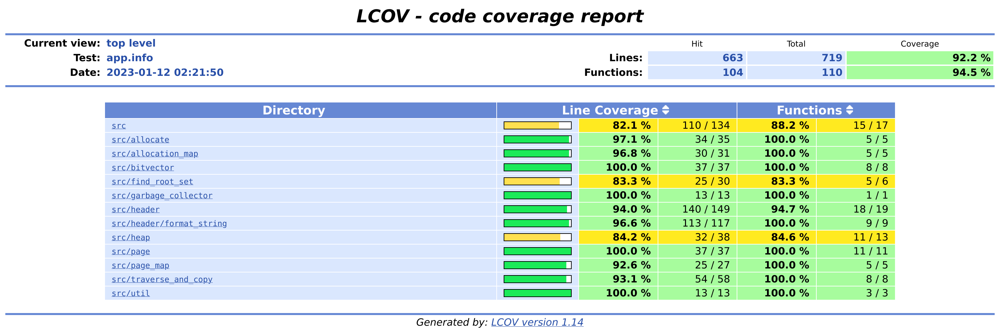

# Test Report

Tests have been carried out on the project on three levels, unit testing, integration testing and regression testing. All tests were automated using CUnit and run with a Makefile. The Makefile had options for running individual tests, all tests sequentially, and running all tests with valgrind. Tests were run periodically while writing the code, before pushing to GitHub and before merging into main.

## Unit testing

Unit tests were created in each module for all interface functions, and for helper functions where appropriate. Edge cases were sought for testing, and an approach of "try to break the program" was taken when writing tests, rather than one of trying to "demonstrate" that the code is functional. Initially in the project "artificial environments" were set up to test the modules, as the heap was not yet in place. Our use of asserts made it difficult to demonstrate "failing cases" in our final tests, as these would all fail in CUnit. Such asserts were however helpful while developing the code to locate bugs or poorly written tests.

## Integration testing

During integration of individual modules with each other, additional tests were created to demonstrate that they were properly integrated. Many of these came naturally as new modules built upon old ones, in other cases creative ways were sought to take a route through the different modules. Integration testing was made much easier once the heap module was in place, as we could then allocate objects directly on a real heap.

Additional integration tests were created once all of the modules had been integrated, that tested the creation of a heap, the allocation of objects and both automatic and manual triggering of garbage collection.

## Regression testing

A number of refactoring attempts were undertaken during the project, and the existing suite of tests then served as regression tests. This created a baseline that could be used to ensure that the new refactoring was equivalent functionally with the original implementation. Any additional tests required for creating this baseline were also created.

Gcov and lcov were used for quantifying the test coverage. A screenshot of the report from lcov is displayed below.

## Bugs and issues

Many of the bugs that we had during implementation were confined to a single module, and dealt with locally before pushing to GitHub. Issues were therefore not created for these. We did however use our other forms of communication through daily meetings and chats on discord to help each other with problems that arose. Below are links to a number of bugs that arose during integration and for which issues were therefore created on GitHub.

- [h_alloc_data() segfaults for bytes inputs of 256 and greater](https://github.com/IOOPM-UU/Undefined/issues/30)
- [Pointer addresses given by the offset array in header.c do not always correspond with actual location in memory](https://github.com/IOOPM-UU/Undefined/issues/29)
- [Function `am_set_allocation' sets all blocks with allocated data to true](https://github.com/IOOPM-UU/Undefined/issues/28)
- [Suspected bug in allocation PR after review plus request for additional tests](https://github.com/IOOPM-UU/Undefined/issues/26)
- [Flera stora allokeringar misslyckas](https://github.com/IOOPM-UU/Undefined/issues/24)